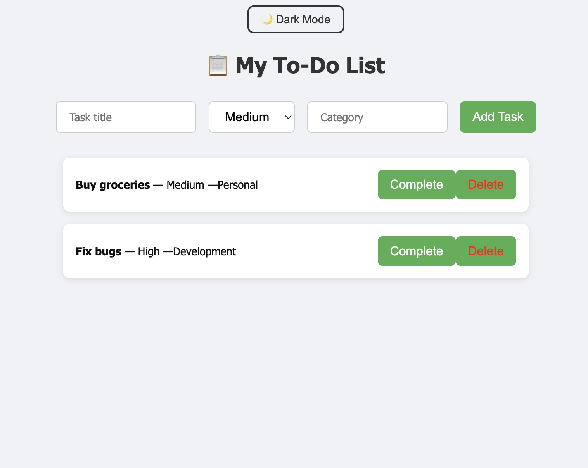
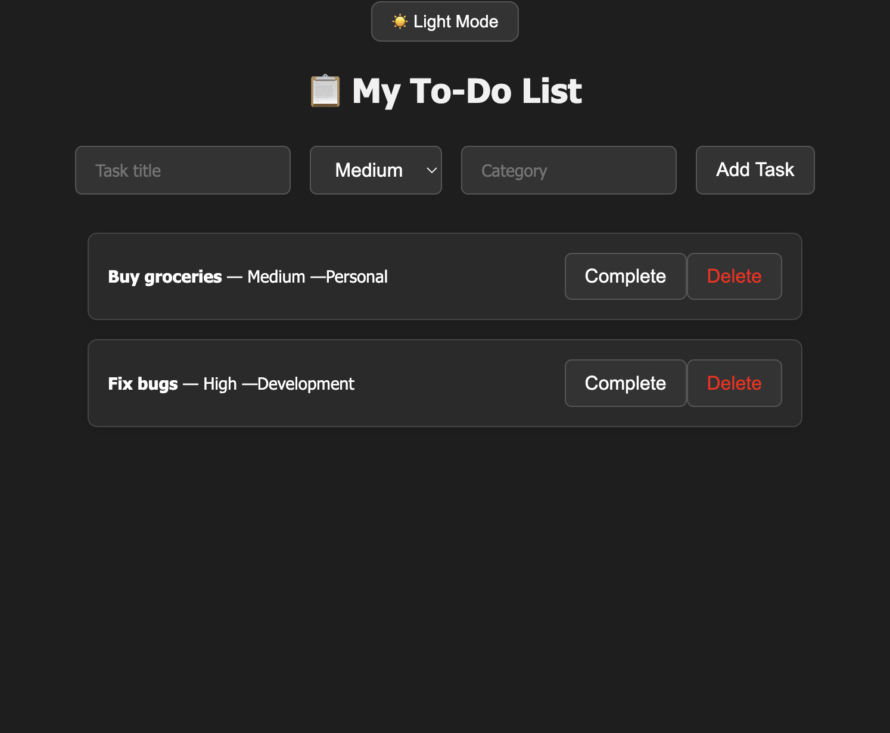

# Advanced To-Do List App 🧠📝

A smart, stylish full-stack To-Do List app with NLP-based category 
suggestions and dark mode. Built from scratch using only the terminal, 
this app shows off both frontend and backend development skills.

---

## 🚀 Tech Stack

- **Frontend:** React.js
- **Backend:** Node.js + Express
- **Database:** MongoDB Atlas (Cloud DB)
- **NLP:** Compromise.js (for smart category suggestions)
- **Styling:** Custom CSS with Dark Mode Toggle

---

## ✨ Features

- ✅ Add, Complete, and Delete tasks
- 🧠 Auto-suggests task categories using NLP (based on title)
- 🌗 Toggle between Dark Mode and Light Mode
- 📂 MongoDB used for real-time database persistence
- 🧼 Clean, responsive UI with animated buttons and layout

---

## 📸 Screenshots

### ✅ Light Mode



---

### 🌙 Dark Mode



---

## 📁 Project Structure

AdvancedToDoApp/ ├── backend/ # Express + Mongoose backend API ├── 
client/ # React frontend ├── screenshots/ # App screenshots used in 
README └── README.md # This file

yaml
Copy
Edit

---

## 🔧 How to Run the Project Locally

1. **Clone this repository**

```bash
git clone https://github.com/YOUR_USERNAME/AdvancedToDoApp.git
Backend Setup:

bash
Copy
Edit
cd backend
npm install
npm start
Frontend Setup:

bash
Copy
Edit
cd ../client
npm install
npm start
Open in browser:
http://localhost:3000

✅ Ensure your MongoDB is configured in the backend .env file

💡 Smart NLP Feature Example
When you type a title like:

"Buy groceries" → category auto-set to Personal

"Fix bugs" → category becomes Development

"Call professor" → becomes Meetings
